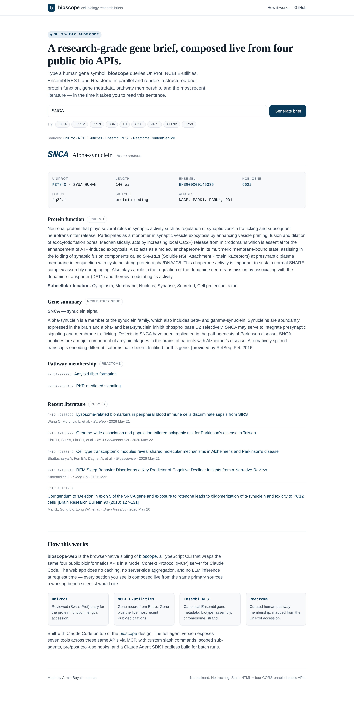
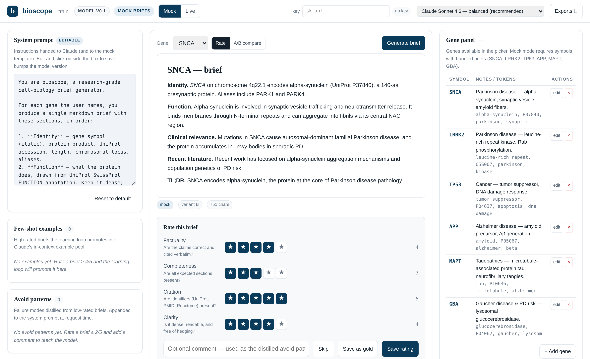

# bioscope-web

A research-grade gene brief, composed live in the browser from four public bioinformatics APIs.

Type a human gene symbol. **bioscope-web** queries [UniProt](https://www.uniprot.org/),
[NCBI E-utilities](https://www.ncbi.nlm.nih.gov/home/develop/api/),
[Ensembl REST](https://rest.ensembl.org/), and
[Reactome ContentService](https://reactome.org/ContentService/) in parallel and renders a
structured brief — protein function, gene metadata, pathway membership, and the five most
recent PubMed citations — in the time it takes you to read this sentence.



## Live demo

Once deployed to GitHub Pages, the app lives at the root of this repository's Pages URL.
Deep links work: append `?gene=SNCA` (or any symbol) to share a specific brief.

## What it is

This is the browser-native sibling of [bioscope](https://github.com/abayatibrain/bioscope) — a TypeScript CLI that
wraps the same four public bioinformatics APIs in a Model Context Protocol (MCP) server for
Claude Code, with custom slash commands, scoped sub-agents, pre/post tool-use hooks, and a
Claude Agent SDK headless build.

`bioscope-web` is deliberately the minimum demonstration of that pipeline that an employer
can try in a single click. It has:

- No backend.
- No build step.
- No dependencies — `index.html` is the whole app.
- No tracking, no analytics.
- No cached results — every brief is composed live from primary sources.

The four APIs all serve `Access-Control-Allow-Origin: *`, so the page calls them directly
from the browser. The only client-side smarts are a small per-host request queue (to respect
NCBI's 3-requests-per-second limit for anonymous traffic) and a 429/503 retry with backoff.

## How a brief is composed

```
User types a symbol
        │
        ▼
┌───────────────────────────── parallel (4 requests) ─────────────────────────────┐
│  UniProt search        NCBI esearch (gene)     Ensembl lookup     PubMed esearch │
│  → accession, function → Entrez gene UID       → Ensembl gene ID  → top 5 PMIDs  │
└────────────────────────────────────────────────────────────────────────────────┘
        │                       │                       │                  │
        │                       ▼                       │                  ▼
        │           NCBI esummary (gene)                │      PubMed esummary
        │           → name, summary, locus              │      → titles, journals, dates
        ▼                       │                       │                  │
Reactome mapping                │                       │                  │
(UniProt → pathways)            │                       │                  │
        │                       │                       │                  │
        ▼                       ▼                       ▼                  ▼
                              Rendered brief
```

Failures in any one source degrade gracefully — the other sections still render with their
own data.

## Training mode (`/train.html`) — human-in-the-loop SME GUI

`bioscope-web` ships a second page, **[train.html](train.html)**, that turns the brief
viewer into a labelling and prompt-engineering workbench. It's the GUI a subject-matter
expert uses to teach the brief generator what "good" looks like.



**The "model" is a JSON object in your browser.** It has no neural weights of its own;
instead it parameterises every brief request through four knobs the learning loop updates
from your preference data:

- `systemPrompt` — instructions handed to Claude (or the mock template).
- `fewShotExamples` — briefs you rated ≥ 4/5 get promoted into Claude's in-context example pool.
- `avoidPatterns` — failure modes distilled from briefs you rated ≤ 2/5 are appended to the system prompt as explicit "don't do this" rules.
- `rubricWeights` — dimensions you tend to rate harshly get more weight in the overall score, so the rubric reflects what you care about, not a uniform average.

The model bumps its version (v0.1 → v0.2 → …) every time the learning loop fires (default: every 3 ratings), and every bump is logged in a version timeline with the diff. State persists in `localStorage`; you can import/export the whole model as JSON, and you can export your accumulated labels in three industry-standard formats: full state JSON, preference pairs as DPO JSONL (chosen/rejected), gold-standard briefs as SFT JSONL (prompt/completion).

**Two run modes:**

| Mode | What it does | When to use it |
| --- | --- | --- |
| **Mock** (default) | Uses a bundled pool of 18 hand-crafted briefs (6 neurodegen + cancer-canon genes × 3 quality variants each: complete-and-cited, partial, hedging-and-vague). Zero API key, fully offline after the page loads. | Demo to employers, practise labelling, or build up enough preference data to be worth running against a real model. |
| **Live** | Calls Claude directly from the browser using your Anthropic API key (`anthropic-dangerous-direct-browser-access` header). Key is stored only in `localStorage`, sent only to `api.anthropic.com`. Streaming via SSE. Lets you pick Sonnet / Opus / Haiku from a dropdown. | Real RLHF-style training: every rating you make actually shifts the next generation, because the model state shapes the next prompt sent to Claude. |

**Three labelling workflows:**

1. **Rate one brief on four dimensions** — Factuality, Completeness, Citation, Clarity. Each 1–5. Optional comment becomes the distilled avoid-pattern if you rate ≤ 2. Saves a `Rating` to the log.
2. **A/B preference** — two briefs side-by-side, pick the winner (or Tie). In live mode, A vs B is *current trained model* vs *bare baseline prompt*, so your preferences become directly DPO-trainable data. In mock mode, A vs B is *high-quality variant* vs *low-quality variant*.
3. **Save as gold standard** — when a brief is good enough to use as an exemplar, save it as an SFT example. Exports as a JSONL with `{messages: [system, user, assistant]}` ready for OpenAI/Anthropic fine-tuning APIs.

**Gene panel CRUD.** The right column lists the genes available in the picker. You can add new symbols (live mode supports any HGNC symbol; mock mode is limited to the bundled six). Each entry stores aliases, free-text notes, and "expected tokens" used by future eval extensions.

**Metrics dashboard.** Counters (ratings, preferences, gold standards, examples, avoid patterns), a rating-distribution histogram, per-dimension trend over the last 12 ratings, and the full version-bump timeline.

### File structure for training mode

```
bioscope-web/
├── train.html              # the training-mode page
├── assets/
│   ├── train.css           # all training-mode styles
│   ├── model.js            # BioscopeModel class — state + learning loop
│   ├── mock-briefs.js      # the 18-brief bundled pool
│   ├── anthropic.js        # direct-from-browser Anthropic adapter
│   └── app.js              # main wiring, UI handlers, rendering
```

### Roadmap: GUI 2

Once you've trained the model to your satisfaction (and exported the state), a second GUI
(`use.html`, planned) will load any model export and act as a clean end-user tool: pick a
gene, get a brief, no labelling controls, no model state visible. The training GUI produces
the artifact; the use GUI consumes it.

## Local development

It's a static page. Open it directly, or serve it for the deep-link `?gene=…` routing:

```bash
python3 -m http.server 8765
# then open http://127.0.0.1:8765/
```

## Project structure

```
bioscope-web/
├── index.html                  # public brief viewer (no training controls)
├── train.html                  # human-in-the-loop SME training GUI
├── assets/
│   ├── train.css               # styles for train.html
│   ├── model.js                # BioscopeModel — state + learning loop
│   ├── mock-briefs.js          # bundled 18-brief pool for mock mode
│   ├── anthropic.js            # direct-from-browser Anthropic adapter
│   └── app.js                  # main wiring for train.html
├── preview.png                 # Handshake AI Showcase tile (SNCA brief above the fold)
├── docs/
│   ├── screenshot-snca-full.png
│   ├── screenshot-snca-brief.png
│   └── screenshot-train.png    # training-mode hero shot for the README
├── .github/workflows/pages.yml # deploys to GitHub Pages on push to main
├── .nojekyll                   # serve as-is, skip Jekyll processing
├── LICENSE
└── README.md
```

## Built with

bioscope-web was built with [Claude Code](https://docs.claude.com/claude-code) using the
same `bioscope` design that exposes these four APIs to Claude as MCP tools. The browser
version drops the agent layer and goes straight to the APIs — the minimum thing an employer
can click on and instantly see what subject-matter expertise looks like in code.

## License

[MIT](LICENSE) — see `LICENSE`.

## Author

Made by [Armin Bayati](https://arminbayati.com).
